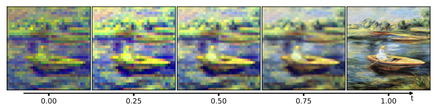

# RAC: Rectified Flow Auto Coder

[[Paper]](https://arxiv.org/abs/2603.05925) [[Project Page]](https://world-snapshot.github.io/RAC/) 

Here is a nano demonstration, which is the initial proof-of-concept code we developed at the beginning of this project. It does not include the full contributions mentioned in the paper (i.e., this is an informal implementation).

More details will be released after the code is cleaned.



**Fig. 1:** The trajectory demonstration of RAC: 
- Make the reconstruction task a condition generation task;
- Make the decoder the encoder;
- Make the single-step decoding and encoding a multi-step decoding and encoding.

## Usage

```code
conda create -n RAC python=3.11 -y
conda activate RAC
pip install numpy matplotlib tqdm torch torchvision diffusers
python train_nano_rac_v1.py

# or
python train_nano_rac_v1.1.py
# The upgraded versions in the middle and later stages
```

## BibTex

```code
@misc{fang2026racrectifiedflowauto,
      title={RAC: Rectified Flow Auto Coder}, 
      author={Sen Fang and Yalin Feng and Yanxin Zhang and Dimitris N. Metaxas},
      year={2026},
      eprint={2603.05925},
      archivePrefix={arXiv},
      primaryClass={cs.CV},
      url={https://arxiv.org/abs/2603.05925}, 
}
```
